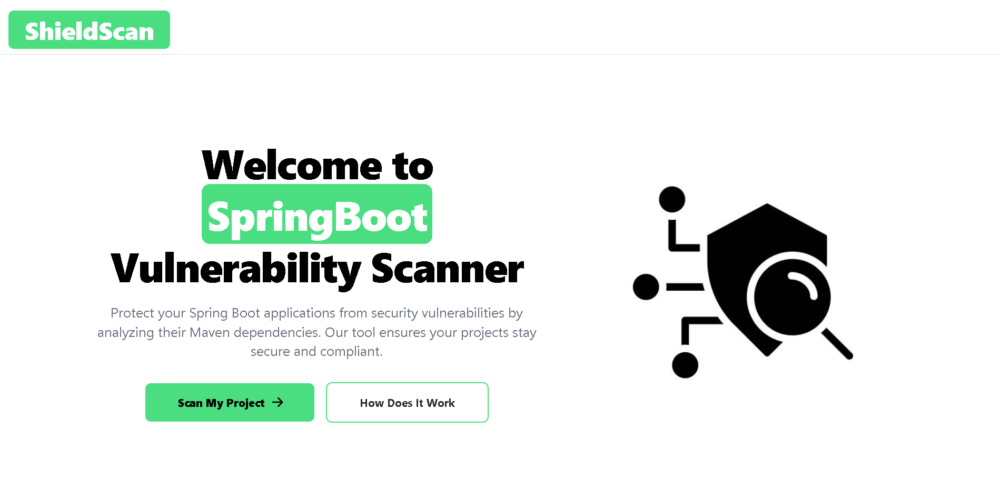

This application, built using .NET MVC Razor Pages, is a dedicated security tool that helps developers detect vulnerabilities in their Maven dependencies. By processing a list of dependencies from an uploaded text file, the app analyzes and cross-references them with a vulnerability database to generate a comprehensive security report.

## How It Works:
- Upload Maven Dependencies: Users upload a text file containing the dependencies from their Spring Boot project. The app extracts and filters the GroupId:ArtifactId:Version format for analysis.

- Automated Vulnerability Lookup: The app scrapes a vulnerability database for each dependency to identify any known risks or issues.
    Detailed Reporting: Once the analysis is complete, the app generates a detailed report, which includes all identified vulnerabilities, their severity levels, and suggested remediations.

- Export Options: The final report can be downloaded as a PDF, providing a shareable and easy-to-reference format for teams.
## Platform UI
### Home Page

### How It Works Page

### Scan Page

